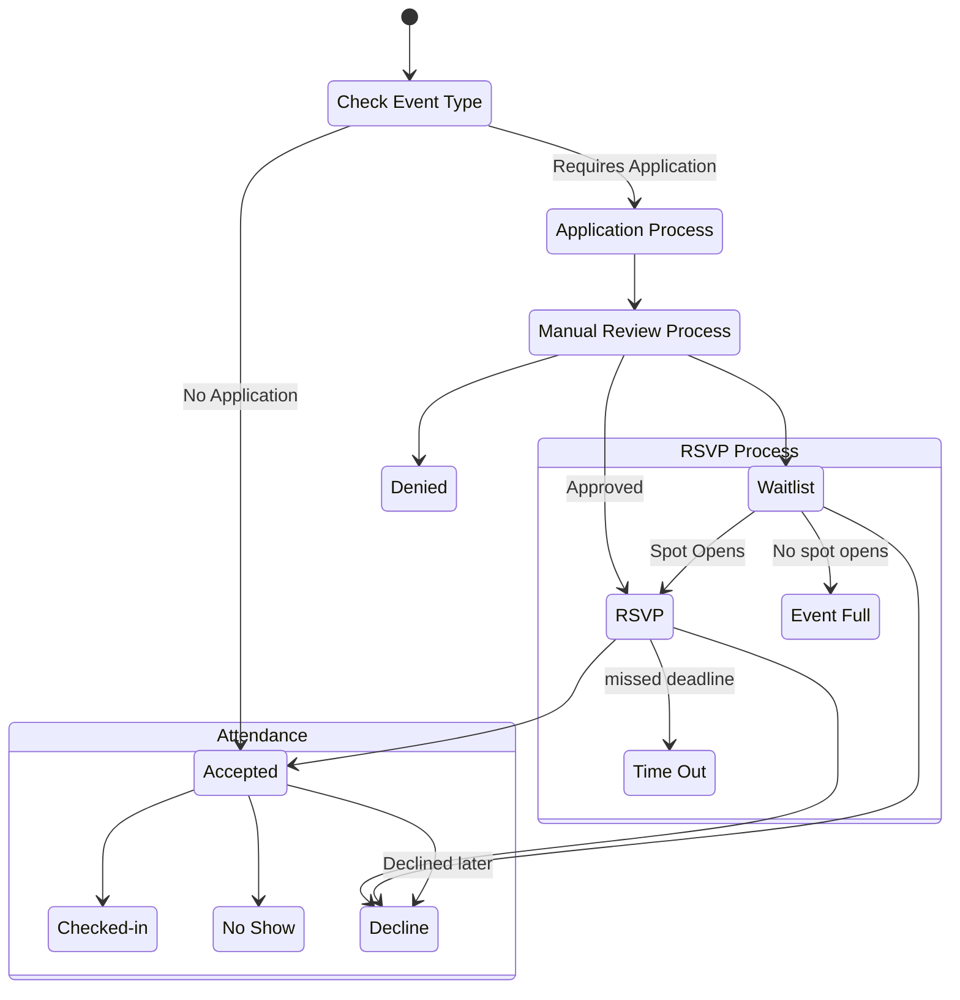
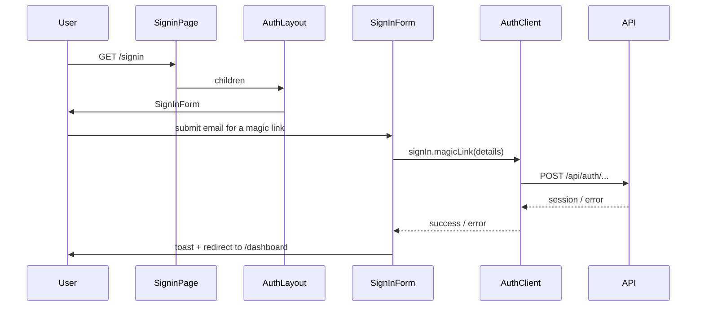
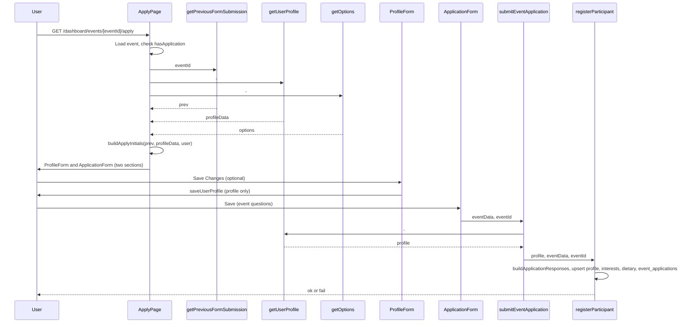

# Architecture Overview

This document provides an overview of the MRUHacks 2026 platform architecture.

## Terminology (Glossary)

Use these terms consistently across UI, code, and docs:

1. **Sign up** – Create a site account (email/password). Do not use "register" for account creation.
2. **Sign in** – Log into the site.
3. **Apply to an event** – For events with an application (`has_application`): user fills profile + event application form. Data in `event_applications` (with `status_id` for manual review: pending_review → approved / denied / waitlisted). UI: "Apply", "Edit application", "applied".
4. **Register for an event** – For events without an application: one-click to attend. UI: "Register", "You are registered", "Unregister".
5. **Event application** – The form and stored data for events that require an application. Use "application" (not "registration") for this flow.
6. **Profile** – User profile (shared across events).
7. **Attendee** – A user in `event_attendees`.
8. **Group** – A team associated with an event; members are in `group_members`. Use for "group" or "team" in UI and docs.
9. **Submission** – A group's submission to an event (e.g. project); stored in `submissions`. Distinct from "event application" (user applying to attend).
10. **Check-in** – Physical verification that an attendee is present (e.g. at event start or at a meal). One row per user per event in `check_ins`; the event can be the main event or a sub-event (e.g. meal). UI: "Check in", "Checked in", etc.

In authz, the entity **"application"** means event application (permissions: approve, reject, read).

## Tech Stack

- **Framework**: [Next.js 15](https://nextjs.org) with React 19 and App Router
- **Authentication**: [Better Auth](https://www.better-auth.com/)
- **Database**: PostgreSQL with [Drizzle ORM](https://orm.drizzle.team/)
- **Styling**: [Tailwind CSS](https://tailwindcss.com/)
- **UI Components**: [Radix UI](https://www.radix-ui.com/)
- **Form Management**: React Hook Form with Zod validation
- **Language**: TypeScript
- **Testing**: Vitest

## Project Structure

```
mruhacks2026/
├── src/
│   ├── app/              # Next.js App Router pages and layouts
│   │   ├── (auth)/       # Authentication pages (signin, signup)
│   │   ├── dashboard/    # Dashboard pages and features
│   │   │   └── events/
│   │   │       └── [eventId]/apply/  # Event application flow (apply to event)
│   │   └── register/     # Simple event signup server actions (no public route)
│   ├── components/       # Reusable React components
│   │   ├── ui/           # Base UI components (shadcn/ui)
│   ├── db/               # Database schema and configurations
│   │   ├── schema.ts     # Main schema exports
│   │   ├── lookups.ts    # Lookup tables (genders, universities, etc.)
│   │   ├── events-and-participation.ts  # Events, applications, RSVP waves/responses, attendees, groups
│   │   └── auth-schema.ts    # Better Auth schema
│   ├── utils/            # Utility functions
│   │   ├── auth.ts       # Authentication utilities
│   │   ├── db.ts         # Database connection
│   │   └── action-result.ts  # Server action result types
│   ├── hooks/            # Custom React hooks
│   └── proxy.ts          # Next.js proxy for route protection
├── scripts/              # Utility scripts (e.g., database seeding)
├── public/               # Static assets
├── drizzle/              # Database migrations
└── docs/                 # Documentation
```

## Key Features

- **User Authentication**: Sign in using magic links, email/password, or OAuth
- **Event Applications**: Event-scoped application flow; events can have applications (full form) or simple signup; application questions are stored on the event
- **Dashboard**:
  - Settings management
  - Group/team management
  - Event schedule
  - Meal tracking
  - Workshop registration
  - Project submissions
- **Responsive Design**: Mobile-first design with tablet and desktop support
- **Route Protection**: Proxy-based authentication for protected routes

## Database Architecture

### Schema Organization

The database schema is organized into three main modules:

1. **auth-schema.ts**: Better Auth tables (users, sessions, accounts)
2. **lookups.ts**: Reference tables for form options (genders, universities, majors, etc.)
3. **events-and-participation.ts**: Events (with `capacity`, optional `event_type_id`), user profiles, event applications (with application status, waitlist position), event RSVP waves and responses, event attendees, check-ins, groups, group members, and submissions

### Key Tables

- `user`: Authenticated users (Better Auth)
- `events`: Events (e.g. hackathon, workshops); optional `parent_event_id` (self-FK) for parent/child hierarchy; optional `event_type_id` (FK to `event_types`: meal, workshop, hackathon); `has_application` and `application_questions` (JSONB) define whether and how users apply; optional `capacity` for waitlist/event-full logic
- `check_ins`: One row per user per event (door check-in or meal check-in); unique on `(user_id, event_id)`; `checked_in_at` timestamp
- `user_profiles`: Profile fields shared across applications (full name, gender, university, major, year of study)
- `user_interests` / `user_dietary_restrictions`: User-level many-to-many with lookups
- `event_applications`: One per user per event (when event has application); `id` (uuid PK), unique on `(event_id, user_id)`; `status_id` (FK to `application_statuses`: pending_review, approved, denied, waitlisted), optional `reviewed_at` / `reviewed_by` / `waitlist_position`; `responses` (JSONB) stores application answers
- `event_rsvp_waves`: One row per invitation wave per event (wave number, `respond_by` deadline)
- `event_rsvp_responses`: One row per user per wave; `status_id` (FK to `rsvp_statuses`: pending, accepted, declined, timed_out), `responded_at`
- `event_attendees`: Simple signup for events without applications; also used for accepted RSVPs
- `groups`: Groups (teams) hosted by an event; `id`, `event_id` (FK to events), `name`
- `group_members`: Junction `(group_id, user_id)`; groups contain users
- `submissions`: Group submissions to events; `id`, `group_id`, `event_id`, `submitted_at`; groups submit to events

### Database Views

- `application_view`: Denormalized view for displaying application data (profile + event + responses)
- `application_form_view`: Structured view for pre-filling the application form (profile + responses)

See [Database Configuration](./DATABASE.md) for more details.

### Registration flow (state diagram)

The following state diagram describes the registration flow: event type check, application process with manual review, RSVP (including waitlist and time out), and attendance. For events without an application, participants who show up without having registered can be asked to register and then follow the normal flow.



## Authentication Flow

Sign-in flow (client → API):



1. User signs in via `/signin` with a magic link, password, or OAuth provider.
2. Better Auth creates or restores the user session.
3. The proxy checks sessions for protected routes (`/dashboard/*`).
4. Unauthenticated requests to protected routes redirect to `/signin`.
5. Authenticated users can access dashboard features

## Event Application Flow

Apply-to-event flow (two sections: profile form and event application form, each with its own submit):



1. User opens the apply page for an event that has an application (`has_application`).
2. The page loads the event, previous submission (if any), profile, and form options in parallel; `buildApplyInitials` derives initial values for profile and event sections.
3. The page renders two sections: **ProfileForm** (with "Save Changes" to save profile only) and **ApplicationForm** (event questions with "Save" to submit the application).
4. Submitting the event section calls `submitEventApplication(eventData, eventId)`, which fetches the current profile server-side and then calls `registerParticipant(profile, eventData, eventId)` to upsert profile, interests, dietary restrictions, and `event_applications.responses` in one transaction.

## Server Actions Pattern

All server actions follow a consistent pattern using the `ActionResult` type:

```typescript
export type ActionResult<T = unknown> =
  | { success: true; data?: T }
  | { success: false; error: string };
```

This provides:

- Type-safe responses
- Consistent error handling
- Easy client-side consumption

Example:

```typescript
const result = await registerParticipant(formData, eventId);
if (result.success) {
  // Handle success
} else {
  // Display result.error
}
```

## Middleware

Next.js middleware (`src/middleware.ts`) protects dashboard routes:

- Intercepts requests to `/dashboard`
- Checks for valid session
- Redirects unauthenticated users to `/forbidden`
- Allows authenticated requests to proceed

## Form Validation

Forms use:

- **React Hook Form** for form state management
- **Zod** for schema validation
- **@hookform/resolvers** to integrate Zod with React Hook Form

Validation occurs on both client and server sides for security.
